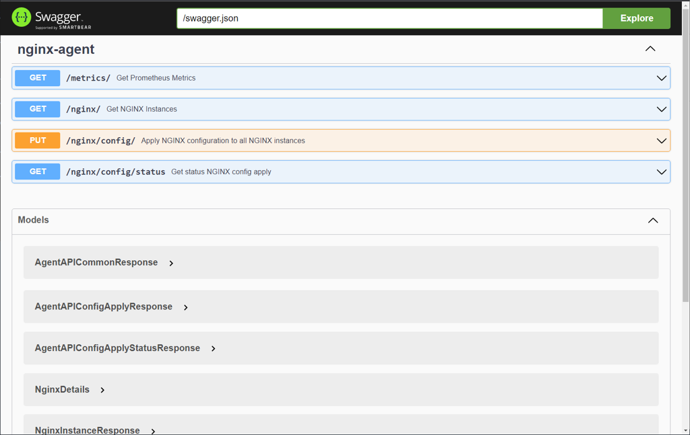
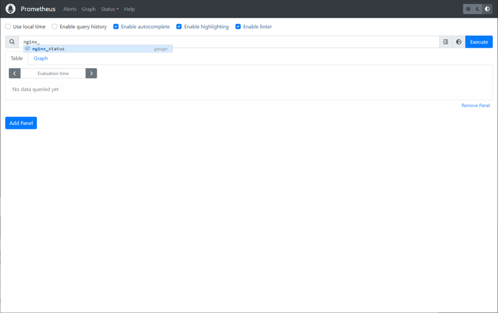
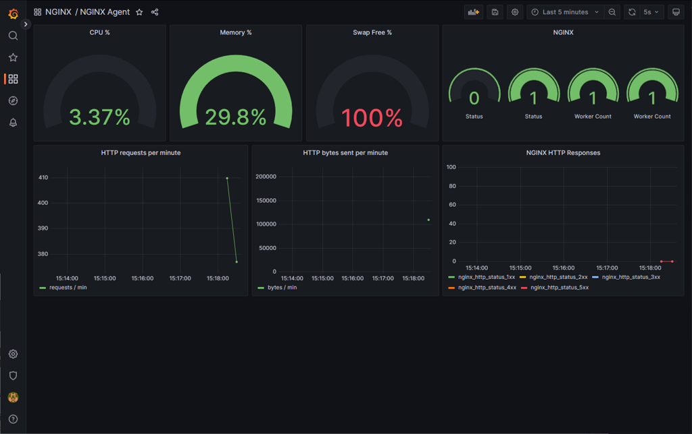
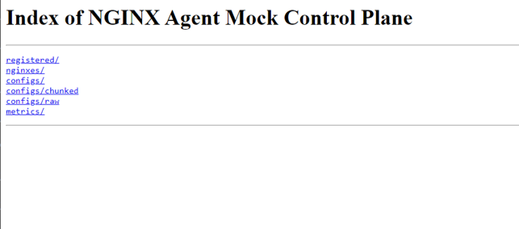

NGINX Plus の設定
####

NGINX Plusをインストールしたホストに対し、NGINX Agentをインストールし動作を確認します。
UDF環境で動作する場合、 ``ubuntu03`` で操作することを想定しています

ドキュメントは以下のページの内容を参照しています

- `GitHub nginx / agent <https://github.com/nginx/agent>`__

- `NGINX Agent Docs <https://docs.nginx.com/nginx-agent/>`__

0. (事前準備) NGINX Plusのインストール
====

1. NGINX Plusのインストール・基礎
----

| 以下のページの内容を参考にNGINX Plus及びモジュールをインストールします
| `NGINX Plus Lab 1. NGINX Plusのインストール (15min) <https://f5j-nginx-plus-lab1.readthedocs.io/en/latest/class1/module2/module2.html#nginx-plus-15min>`__

| また、このラボは以下の内容を理解していることを前提としています。
| 初めてNGINX Plusを操作する方は、以下より基本的な挙動について確認をしてください。
- `NGINX Plus Lab 3. 基本的な動作の確認 <https://f5j-nginx-plus-lab1.readthedocs.io/en/latest/class1/module2/module2.html#id3>`__ を参照してください

2. 必要なファイルの取得
----

NGINX Agent の動作や初期設定で参照するGitHubのレポジトリを取得します

.. code-block:: cmdin

  sudo su - 
  git clone https://github.com/nginx/agent.git

  git clone https://github.com/BeF5/f5j-nginx-agent-lab.git

3. Goのインストール
----

NGINX Agent及びMockアプリケーションはGoを利用します。
以下ページよりGoをインストールしてください。このラボでインストールする NGINX Agent ``v2.23.1`` は ``Go 1.19以上`` が必要となります

インストール手順はGoのマニュアルを参照しています

- `Go Download and Install <https://go.dev/doc/install>`__

- `Go All Release <https://go.dev/dl/>`__

.. NOTE::

  こちらの手順は Go 1.20.1 のインストール手順となります

以下手順を参考にインストールします

.. code-block:: cmdin

  sudo su -
  # ファイルの取得
  wget https://go.dev/dl/go1.20.1.linux-amd64.tar.gz

  # ファイルの展開
  rm -rf /usr/local/go && tar -C /usr/local -xzf go1.20.1.linux-amd64.tar.gz
  
  # PATHの設定
  export PATH=$PATH:/usr/local/go/bin

インストールしたバージョンを確認します

.. code-block:: cmdin

  go version

.. code-block:: bash
  :caption: 実行結果サンプル
  :linenos:

  go version go1.20.1 linux/amd64

4. makeのインストール
----

一部手順で make を利用します。必要に応じてインストールしてください

.. code-block:: cmdin

 sudo apt install make

インストールしたバージョンを確認します

.. code-block:: cmdin
  
  make -v

.. code-block:: bash
  :caption: 実行結果サンプル
  :linenos:

  GNU Make 4.2.1
  Built for x86_64-pc-linux-gnu
  Copyright (C) 1988-2016 Free Software Foundation, Inc.
  License GPLv3+: GNU GPL version 3 or later <http://gnu.org/licenses/gpl.html>
  This is free software: you are free to change and redistribute it.
  There is NO WARRANTY, to the extent permitted by law.

5. jq のインストール
----

.. code-block:: cmdin
 
  sudo apt install jq

1. NGINX Agent のインストール
====

NGINX Agentをインストールする環境のOS/CPUに応じたパッケージを取得します

- `GitHub nginx / agent Release <https://github.com/nginx/agent/releases>`__

1. OS/CPUの確認
----

.. code-block:: cmdin

  cat /etc/os-release

.. code-block:: bash
  :caption: 実行結果サンプル
  :linenos:

  NAME="Ubuntu"
  VERSION="20.04.2 LTS (Focal Fossa)"
  ID=ubuntu
  ID_LIKE=debian
  PRETTY_NAME="Ubuntu 20.04.2 LTS"
  VERSION_ID="20.04"
  HOME_URL="https://www.ubuntu.com/"
  SUPPORT_URL="https://help.ubuntu.com/"
  BUG_REPORT_URL="https://bugs.launchpad.net/ubuntu/"
  PRIVACY_POLICY_URL="https://www.ubuntu.com/legal/terms-and-policies/privacy-policy"
  VERSION_CODENAME=focal
  UBUNTU_CODENAME=focal

.. code-block:: cmdin

  uname -m

.. code-block:: bash
  :caption: 実行結果サンプル
  :linenos:

  x86_64

この例では OS Version ``focal`` CPU ``amd64`` に対応したNGINX Agent ``v2.23.1`` をダウンロードします。

.. code-block:: cmdin

  wget https://github.com/nginx/agent/releases/download/v2.23.1/nginx-agent-2.23.1.focal_amd64.deb

2. NGINX Agentのインストール
----

.. code-block:: cmdin

  sudo dpkg -i nginx-agent-2.23.1.focal_amd64.deb

.. code-block:: bash
  :caption: 実行結果サンプル
  :linenos:

  Selecting previously unselected package nginx-agent.
  (Reading database ... 148909 files and directories currently installed.)
  Preparing to unpack nginx-agent-2.23.1.focal_amd64.deb ...
  
   --- NGINX Agent Package Installer ---
  
   --- Will install the NGINX Agent in 5 seconds ---
  Sudo permissions detected
  Could not find /etc/nginx-agent/agent-dynamic.conf ... Creating file
  Successfully created /etc/nginx-agent/agent-dynamic.conf
  Updating /etc/nginx-agent/agent-dynamic.conf ...
  Agent config file /etc/nginx-agent/nginx-agent.conf does not exist. Could not be updated
  Unpacking nginx-agent (2.23.1~focal) ...
  Setting up nginx-agent (2.23.1~focal) ...
  PostInstall: Reading NGINX systemctl unit file for user information
  NGINX processes running as user 'root'. nginx-agent will be configured to run as same user
  PostInstall: Reading NGINX process information to determine NGINX user
  NGINX processes running as user 'nginx'. nginx-agent will try add that user to 'nginx-agent'
  Sudo permissions detected
  Found nginx-agent /usr/bin/nginx-agent
  PostInstall: Adding nginx-agent group nginx-agent
  PostInstall: Adding NGINX / agent user root to group nginx-agent
  PostInstall: Adding NGINX Worker user nginx to group nginx-agent
  PostInstall: Creating NGINX Agent run directory
  PostInstall: Modifying group ownership of NGINX Agent run directory
  PostInstall: Modifying NGINX Agent unit file with correct locations and user information
  PostInstall: Reload the service unit from disk
  PostInstall: Unmask the service unit from disk
  PostInstall: Set the preset flag for the service unit
  Created symlink /etc/systemd/system/multi-user.target.wants/nginx-agent.service → /etc/systemd/system/nginx-agent.service.
  PostInstall: Set the enabled flag for the service unit
  ----------------------------------------------------------------------
   NGINX Agent package has been successfully installed.
  
   Please follow the next steps to start the software:
      sudo systemctl start nginx-agent
  
   Configuration settings can be adjusted here:
      /etc/nginx-agent/nginx-agent.conf
  
  ----------------------------------------------------------------------

正しくインストールしたことを確認します

.. code-block:: cmdin

  dpkg -l | grep nginx-agent

.. code-block:: bash
  :caption: 実行結果サンプル
  :linenos:

  ii  nginx-agent                        2.23.1~focal                          amd64        NGINX Agent

3. NGINX Agent の起動・自動起動を有効にする
----

NGINX Agentを起動、自動起動を有効にします

.. code-block:: cmdin

  sudo systemctl start nginx-agent
  sudo systemctl enable nginx-agent

正しく起動したことを確認します

.. code-block:: cmdin

  ps -ef | grep nginx-agent

.. code-block:: bash
  :caption: 実行結果サンプル
  :linenos:

  root        2027       1 99 14:25 ?        00:00:08 /usr/bin/nginx-agent

.. code-block:: cmdin

  sudo systemctl status nginx-agent

.. code-block:: bash
  :caption: 実行結果サンプル
  :linenos:

  ● nginx-agent.service - NGINX Agent
       Loaded: loaded (/etc/systemd/system/nginx-agent.service; enabled; vendor preset: enabled)
       Active: active (running) since Fri 2023-03-03 15:32:49 JST; 5s ago
         Docs: https://github.com/nginx/agent#readme
      Process: 5375 ExecStartPre=/bin/mkdir -p /var/run/nginx-agent (code=exited, status=0/SUCCESS)
      Process: 5376 ExecStartPre=/bin/mkdir -p /var/log/nginx-agent (code=exited, status=0/SUCCESS)
     Main PID: 5377 (nginx-agent)
        Tasks: 5 (limit: 2327)
       Memory: 4.0M
       CGroup: /system.slice/nginx-agent.service
               └─5377 /usr/bin/nginx-agent
  
  Mar 03 15:32:49 ip-10-1-1-7 systemd[1]: Starting NGINX Agent...
  Mar 03 15:32:49 ip-10-1-1-7 systemd[1]: Started NGINX Agent.
  Mar 03 15:32:49 ip-10-1-1-7 nginx-agent[5377]: time="2023-03-03T15:32:49+09:00" level=warning msg="Log level is info"
  Mar 03 15:32:49 ip-10-1-1-7 nginx-agent[5377]: time="2023-03-03T15:32:49+09:00" level=info msg="setting displayName to ip-10-1-1-7"
  Mar 03 15:32:49 ip-10-1-1-7 nginx-agent[5377]: time="2023-03-03T15:32:49+09:00" level=info msg="NGINX Agent v2.23.1 at 8fa9a62e wi>
  Mar 03 15:32:49 ip-10-1-1-7 nginx-agent[5377]: time="2023-03-03T15:32:49+09:00" level=error msg="Unable to create command channel:>
  Mar 03 15:32:49 ip-10-1-1-7 nginx-agent[5377]: time="2023-03-03T15:32:49+09:00" level=info msg="Commander retrying to connect to 1>
  
NGINX Agentのログは以下に出力されます

.. code-block:: cmdin

  ls /var/log/nginx-agent/

.. code-block:: bash
  :caption: 実行結果サンプル
  :linenos:

  agent.log

2. NGINX Agent 設定ファイルの確認
====

NGINX Agent の設定ファイルに必要な内容を追加します。

.. code-block:: cmdin

  # フォルダが存在しない場合
  # sudo mkdir /etc/nginx-agent
  sudo cp /etc/nginx-agent/nginx-agent.conf /etc/nginx-agent/nginx-agent.conf-
  sudo touch /etc/nginx-agent/agent-dynamic.conf

  sudo cp ~/f5j-nginx-agent-lab/config/nginx-agent.conf /etc/nginx-agent/

外部からの接続を受けるため、以下のような設定となります

.. code-block:: cmdin

  tail -13 /etc/nginx-agent/nginx-agent.conf

.. code-block:: bash
  :caption: 実行結果サンプル
  :linenos:

  api:
    # default port for Agent API, this is for the server configuration of the REST API
    port: 8081
  
  server:
    # host of the control plane
    host: 127.0.0.1
    grpcPort: 54789
  # tls options - NOT RECOMMENDED FOR PRODUCTION
  tls:
    enable: false
    skip_verify: true

これらの設定が完了することでNGINX Agentはステータスを以下ポートでの処理が可能な状態となります

+---------+------+
|gRPC Port|54789 |
+---------+------+
|REST Port|8081  |
+---------+------+

設定を反映します

.. code-block:: cmdin

  sudo systemctl restart nginx-agent

3. Swagger のインストール
====

1. インストール
----

NGINX Agent及びMockアプリケーションはGoを利用します。
以下ページよりGoをインストールしてください。このラボでインストールする NGINX Agent ``v2.23.1`` は ``Go 1.19以上`` が必要となります

インストール手順はGoのマニュアルを参照しています

- `Swagger Installs <https://goswagger.io/install.html>`__

.. NOTE::

  こちらの手順は Go 1.20.1 のインストール手順となります

以下手順を参考にインストールします

.. code-block:: cmdin

  download_url=$(curl -s https://api.github.com/repos/go-swagger/go-swagger/releases/latest | \
    jq -r '.assets[] | select(.name | contains("'"$(uname | tr '[:upper:]' '[:lower:]')"'_amd64")) | .browser_download_url')
  sudo curl -o /usr/local/bin/swagger -L'#' "$download_url"
  sudo chmod +x /usr/local/bin/swagger

Swagger UIの実行

.. code-block:: cmdin

  cd ~/agent/
  make launch-swagger-ui
  # 2回目以降は make launch-swagger-ui & でSwaggerUIを実行できます

.. code-block:: bash
  :caption: 実行結果サンプル
  :linenos:

  ** 省略 **
  go run github.com/go-swagger/go-swagger/cmd/swagger serve ./docs/swagger.json -F=swagger --port=8082 --no-open
  2023/03/03 17:09:42 serving docs at http://localhost:8082/docs

踏み台ホストでChromeを起動し、 `http://10.1.1.5:8082/docs <http://10.1.1.5:8082/docs>`__ に接続してください

2. curl を使った Statusの確認
----

NGINX Agent が ``8081`` で待ち受けるREST APIに対してステータスの確認が出来ます。
参考情報は `Tips1. curｌによるNGINX Agent RESTの結果 <https://f5j-nginx-agent.readthedocs.io/en/latest/class1/module09/module09.html#tips1-curl>`__ を参照してください。

4. Grafana / Prometheus のインストール
====

  cd ~/f5j-nginx-agent-lab/docker-compose
  docker-compose -f docker-compose.yml up -d

正しくコンテナが起動すると、以下ポートでサービスが起動します

+----------+------+
|Grafana   |3000  |
+----------+------+
|Prometheus|9090  |
+----------+------+

踏み台ホストでChromeを起動し、 Prometheus `http://10.1.1.5:9090 <http://10.1.1.5:9090>`__ に接続してください。正しく起動している場合、以下のような画面が表示されます

踏み台ホストでChromeを起動し、 Grafana `http://10.1.1.5:3000 <http://10.1.1.5:3000>`__ に接続してください。正しく起動している場合、以下のような画面が表示されます

以下の情報でログインします。初回時にパスワードを変更するよう促されますので適宜パスワードを指定してください

Top画面の下部に表示された ``NGINX Agent`` のダッシュボードをクリックするとステータスが取得できます。
(すべての項目が表示されるまで5分ほど必要となります)

5. モックアプリケーションの起動
====

1. インストール
----

こちらのモックアプリケーションはGoを利用します。 `Goのインストール <#go>`__ の手順を参考にGoのインストールを行ってください

モックアプリケーションを実行します

.. code-block:: cmdin

  cd ~/agent/
  go run sdk/examples/server.go
  # 初回は必要なファイルのダウンロードなどプログラムの実行に約1分かかります
  # 2回目以降は go run sdk/examples/server.go & でSwaggerUIを実行できます

.. code-block:: bash
  :caption: 実行結果サンプル
  :linenos:

  ** 省略 **
  INFO[0000] http listening
  INFO[0000] gRPC listening

踏み台ホストでChromeを起動し、 `http://10.1.1.5:54790 <http://10.1.1.5:54790>`__ に接続してください

2. curl を使った Statusの確認
----

NGINX Agent が ``8081`` で待ち受けるREST APIに対してステータスの確認が出来ます。
参考情報は `Tips2. curlによるモックアプリケーションの結果 <https://f5j-nginx-agent.readthedocs.io/en/latest/class1/module09/module09.html#tips2-curl>`__ を参照してください。

